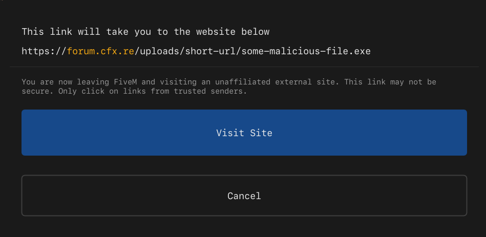

# CitizenFX OpenURL Trusted Domain Abuse

> **Risk:** Low-Medium | **Status:** Patched  
> **Updated:** May 29th, 2026

## Overview

Threat actors exploited the trusted urls in the **OpenURL** native by leveraging XSS vulnerabilities and trusted domain behavior. By hosting malicious payloads on domains like **cfx.re**, threat actors reduced user suspicion and increased execution rates through social engineering, resulting in confirmed system compromises.



## Root Cause

The issue exists in `NUICallbacks_Native.cpp`, which handles native calls from the NUI system. The `openUrl` functionality uses a domain whitelist to determine whether a URL should trigger a permission prompt or bypass it entirely.

```cpp
static bool IsUrlTrusted(const std::string& url)
{
	static constexpr std::array<std::string_view, 6> trustedDomains = {
		"cfx.re", "fivem.net", "redm.net", 
		"rockstargames.com", "rsg.ms", "take2games.com"
	};
	static constexpr std::array<std::string_view, 1> untrustedSubdomains = {
		"users.cfx.re"
	};
	// ...
}
```

**Problem:** The trust model assumes domain ownership equals content safety, but fails to account for:
- Compromised trusted infrastructure
- Malicious uploads on legitimate domains

## Attack Chain

1. **XSS injection** in NUI context
2. **JavaScript execution** via malicious payload
3. **First `openUrl` call** to trusted domain (decoy)
4. **Second `openUrl` call** to malicious binary
5. **User manipulation** + execution
6. **System compromise**

## Discovery

The issue emerged through real world attacks and an infostealer campaign targeting multiple Cfx.re ecosystem servers. Threat actors used:
- Backdoors
- HTML/JavaScript injection (XSS)
- Social engineering

The attack succeeded because users received no warnings when downloading from whitelisted domains, resulting in compromised systems.

## Attack Effectiveness

Threat actors exploited XSS vulnerable resources to inject payloads, often redirecting to legitimate Cfx.re support articles to appear credible.

```lua
TriggerServerEvent('example:event', 
    "",
)
```
> Example Payload (Note: This is an example of a vulnerable resource being exploited with XSS)

The first `openUrl` opens a trusted article; the second silently downloads a malicious binary from `forums.cfx.re` without warnings. Attackers then force-closed the game and used social engineering to execute the file (disguised as `FiveM.exe`).

## Resolution

The Cfx.re security team patched this oversight by strengthening the domain trust validation. While it's not the most perfect patch as I believe in `Zero Trust` solutiuons, it effectively mitigates the immediate risk by blocking known abuse patterns while allowing legitimate use cases to continue functioning.

The fix has been deployed to **production**.

```cpp
if (host == "forum.cfx.re" && parsed->pathname().find("/uploads/") == 0)
{
	return false;
}
```

## References


- [GitHub - NUICallbacks_Native.cpp](https://github.com/citizenfx/fivem/blob/cc6032bec3569c48097f708419f0690ace0bbe14/code/components/nui-core/src/NUICallbacks_Native.cpp)
- [GitHub - NUICallbacks_Native.cpp Patch](https://github.com/citizenfx/fivem/commit/bbca6820faac89b3a03627cde30ed3a271ec7b75)


[Back to Top](#citizenfx-openurl-trusted-domain-abuse)

