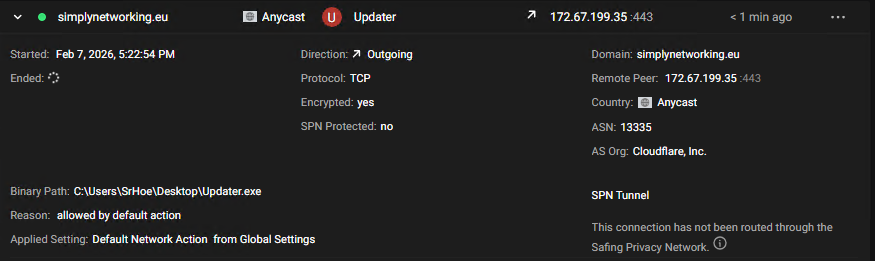

# "Zen/Strela" - Cfx.re Malware Campaign
**Tags**: `InfoStealer`, `Rootkit`, `Persistent`, `VM Detection`, `XOR`, `Targeted`, `MaaS (Malware as a Service)`, `StrelaStealer`

## Summary
A few servers have fallen victim to targeting over the past few months by one or more threat actors abusing XSS vulnerabilities in well known resources made by various developers, whether paid and locked down by [Escrow](https://docs.fivem.net/docs/server-manual/asset-escrow/) or free and open source. On February 4, 2026, I was alerted by a few friends that a server, which will remain redacted, was being targeted by multiple threat actors distributing infostealing malware through `OpenURL`. OpenURL is a call that tells the FiveM client to open a URL in the player's default web browser. While it may be useful for sharing links to a website, Discord, or forum, it can also be abused by server owners, threat actors, or disgruntled staff members. If you wish to see more on `OpenURL` and the drawbacks and recent security updates, please visit [Cfx.re OpenURL Abuse & ZeroTrust](../cfx/05-29-26-openurl-abuse.md).

## Sample Comparison
| Field | Initial (February 4, 2026) | Latest (May 29th, 2026) |
|-------|-----------------------------------|---------------------------------|
| **Filename** | FiveM.exe (1.14 MB) | FiveM.exe (1.03 MB) |
| **Type** | PE32+ executable (GUI) x86-64 | PE32+ executable (GUI) x86-64 |
| **SHA-256** | `7b400086294e19e6231be2b6f75c0c0426f52f07f0a314de6c6d4f3b4bbafd2f` | `cecb0170c188799ae1090f08b82447d90a2c52395fa6c9833cb945a7bdb7adc1` |
| **Packed** | No | No |
| **Signed by** | Hunter Team Labs, Inc. (Hunter Team Labs, Inc.) | XRYUS TECHNOLOGIES LIMITED (XRYUS TECHNOLOGIES LIMITED) |
| **Family** | Unknown (Stealer) | StrelaStealer |
| **VTLinks** | [VencordInstaller.exe](https://www.virustotal.com/gui/file/cecb0170c188799ae1090f08b82447d90a2c52395fa6c9833cb945a7bdb7adc1) | [FiveM.exe](https://www.virustotal.com/gui/file/cecb0170c188799ae1090f08b82447d90a2c52395fa6c9833cb945a7bdb7adc1) [Nothing.exe](https://www.virustotal.com/gui/file/19a03fe5c6a62cc4d1d0fb37b5e1e7f3c2fafc81d645a570923b234c033afe3d) | 
| **TRLinks** | [Threat.rip Results](https://www.threat.rip/file/7b400086294e19e6231be2b6f75c0c0426f52f07f0a314de6c6d4f3b4bbafd2f) | [Threat.rip Results](https://www.threat.rip/file/cecb0170c188799ae1090f08b82447d90a2c52395fa6c9833cb945a7bdb7adc1)

This malware campaign leveraged the domain `ht[t][p]s://update-fivem.net`, a phishing attempt designed to deceive players. 
The threat actors created an identical replica of the legitimate `fivem.net` domain, owned by [Rockstar Games](https://www.rockstargames.com/), to maximize credibility and exploit user trust. The file was reverse engineered both statically and dynamically to confirm that it was malicious. I also ran it through additional AV engines and malware analysis services to verify that the results were consistent across multiple sources.

Through static analysis, I identified a [XOR](https://en.wikipedia.org/wiki/XOR_cipher) routine used to obfuscate malware related strings in URLs and file paths. Although XOR is a basic obfuscation method, it can still hide key indicators and reduce detection consistency across AV engines and analysis platforms. The sample communicates with `h[tt]p[s]://cia.associates`, which was the actor's previously known domain. As of last month, a new domain, `[ht]t[p]s://simplynetworking.eu`, was registered and exposes matching API structure and file paths. Correlation is further supported by the fact that `cia.associates` now redirects to `simplynetworking.eu` which is the new malware path from this latest attack. You can view a full pcap report [here](../../assets/zen_mal_network.pcap)

During dynamic analysis, I observed weak VM detection and sandbox evasion logic. While the primary dropper includes some environment checks, the dropped payload did not. Upon execution, I identified several key behaviors. A directory named **Zen** is created under `\AppData\Local`, containing two files: **Installer.exe** and **ZenCrashHandler.exe**. These files install the primary file referenced from the api route `/api/GetInstallerUrl` to get the binary. When the next payload gets ran, the malware requests `/api/GetOverlayHash` (Assuming this is related to desktop viewing). While using [Portmaster](https://safing.io/), I observed a persistent socket connection. Additionally, an object named `ZenHeartbeat` is created and can be seen under `LOCAL/ZENHEARTBEAT` in [WinObj](https://learn.microsoft.com/en-us/sysinternals/downloads/winobj).

Other than that, I played around with the malware sample a little more. Funny enough. the person running the campaign even interacted with me by typing in notepad, crashing my vm, reversing my mouse, and more.

## How did this malware spread?
This malware campaign leveraged the Cfx.re ecosystem (FiveM), a popular Grand Theft Auto V multiplayer platform. Adversaries compromised individual FiveM servers primarily by:

- Exploiting backdoors in leaked or trojanized server resources/plugins.
- Abusing cross site scripting (XSS) and other resources/plugins.
- Distributing malicious “update” or installer files via phishing and social engineering techniques.
- Leaked Assets - Graphic Packs, Resources, Etc.

## Tools Used
* [Portmaster](https://safing.io/)
* [Wireshark](https://www.wireshark.org/)
* [SysInternals Procmon](https://learn.microsoft.com/en-us/sysinternals/downloads/procmon)
* [SysInternalsWinObj](https://learn.microsoft.com/en-us/sysinternals/downloads/winobj)